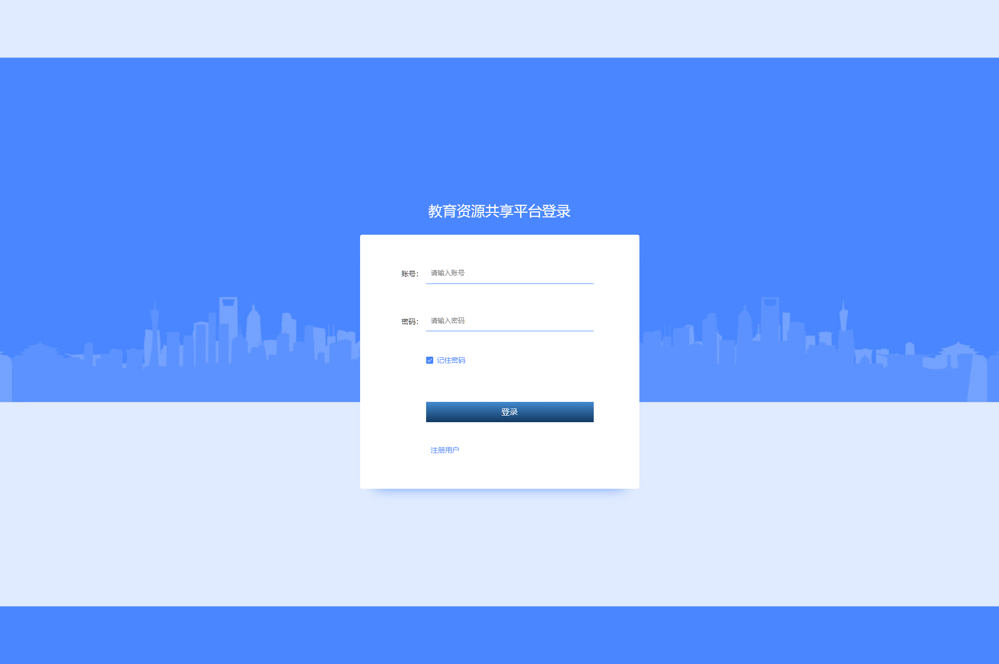
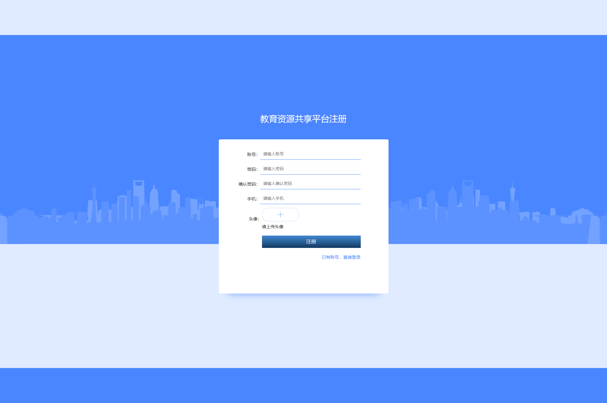
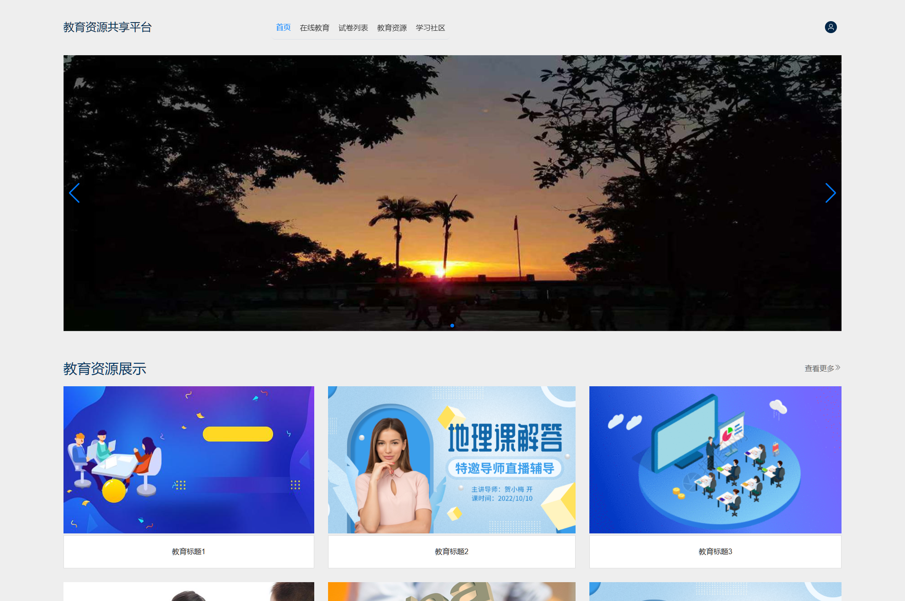
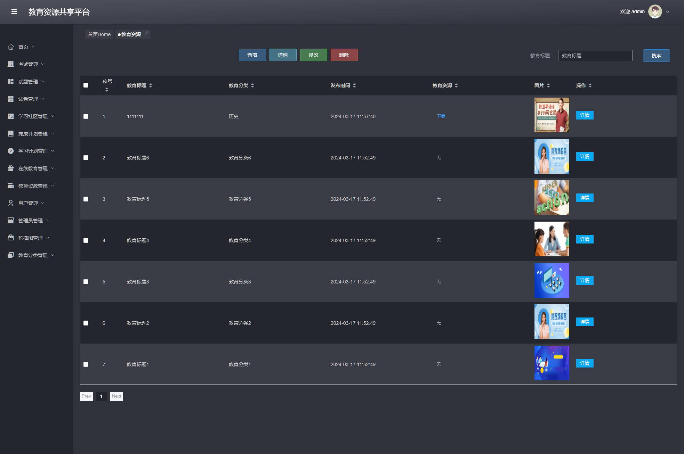
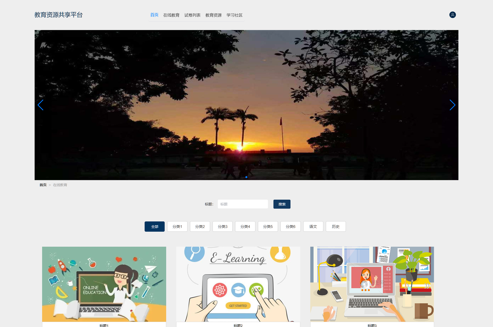

## 🌟 项目简介

这是一个基于 **Java + SpringBoot + Vue + MySQL** 构建的完整教育资源共享平台，功能持续优化中...

### 🧩 功能模块一览

- 用户管理（管理员、用户）
- 教育分类管理
- 教育资源管理（教育标题、教育分类、发布时间、教育资源文件、图片）
- 在线教育管理（标题、分类、视频、详情、图片）
- 学习计划管理（账号、计划标题、计划内容、状态）
- 完成计划管理（计划标题、计划内容、完成时间）
- 学习社区管理（发帖与回复）
- 试卷管理
- 试题管理
- 考试记录与错题本
- 轮播图管理
- 前台教育资源浏览与收藏
- 前台在线教育视频浏览
- 前台在线考试
- 用户注册与个人中心

### 🖼️ 界面预览

|  |  |  |
|--------------------------|--------------------------|--------------------------|
|  |  |  |

---

## ⚙️ 运行环境与工具要求

为了确保项目顺利运行，请确认您的开发环境满足以下条件：

### ✅ 推荐配置
- **Java**: JDK 1.8  
- **MySQL**: 8.0.41  
- **Node.js**: 16.20.2  

⚠️ *温馨提示：版本不一致可能导致依赖冲突或启动失败。*

### 🛠️ 开发工具推荐
- **后端开发**: IntelliJ IDEA 2022+  
- **前端开发**: VS Code  
- **数据库管理**: Navicat / DBeaver / MySQL Workbench  ...

---

## 📲 获取更多帮助和服务

### 🔍 联系我们
关注公众号【斯内普的数字坩埚】即可获取：

- 其它免费的项目程序  
- 远程部署服务和讲解  
- 定制、二开、UI优化
- 微信/QQ 联系方式  

📷 扫码关注👇  

---

